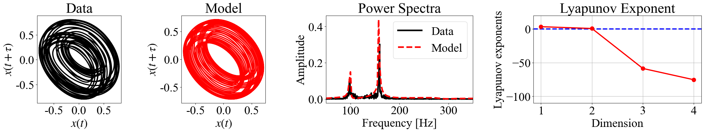

# Time Series Analysis Using Echo State Network
The sample codes provided here use ESN to perform system identification on time series data and estimate the system's Lyapunov exponent. This technique was first introduced in a paper by J. Pathak et al. 

J. Pathak, Z. Lu, B. R. Hunt, M. Girvan, and E. Ott, Using machine learning to replicate chaotic attractors and calculate Lyapunov exponents from data, Chaos: An Interdisciplinary Journal of Nonlinear Science, vol.27,(12), December 2017.
[[Link]](https://arxiv.org/pdf/1710.07313.pdf)

By calculating the Lyapunov exponent, it becomes possible to quantitatively evaluate the instability and dimensionality of the dynamics in a data-driven way. The sample codes included in this description perform analyses on both the one-variable Lorenz system and the vocal fold vibration data obtained from the physical model of vocal folds. The results obtained from the analysis of the vocal data are presented here. 



The ESN parameters need to be adjusted manually, but once successful, it becomes possible to reproduce the system's true attractor from real data contaminated with noise and to measure detailed frequency domains. The vocal data used in the analysis was observed by T. Matsumoto et al, and the corresponding paper has been published.

T. Matsumoto, M. Kanaya, D. Matsushima, C. Han, and I. T. Tokuda, Synchronized and Desynchronized Dynamics Observed from Physical Models of the Vocal and Ventricular Folds, Journal of Voice, December 2021。
[[Link]](https://www.sciencedirect.com/science/article/pii/S0892199721003581?casa_token=l3j8-1zgEnMAAAAA:6NkvQuTElFXKwLoyBeaI0Q-gJCgTS2nQ1BGGC4tEjRx1iM1pX1nwZnE2fuT16Ju4pEKQrccDqP7B)

## Data Preparation（Mic data）
Rhythm Lab's students can get the preprocessed datasets from lab's NAS. Please download VF_FVF_DATASETS from the NAS, and save it in ```/data```. 

